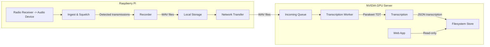
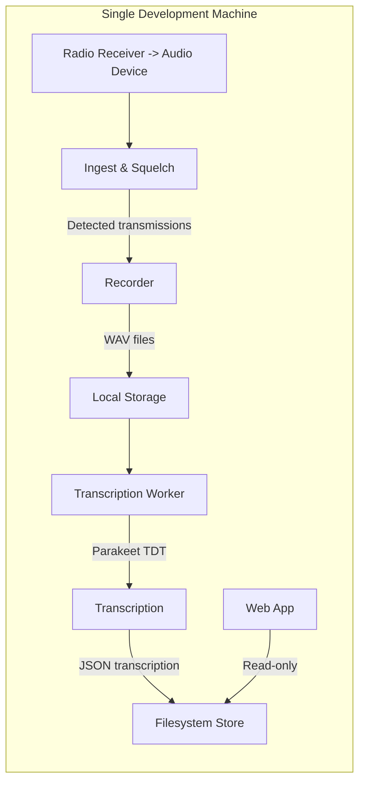

# Lauschomat: Realtime Radio Transcription System — Project Plan

## 1) Overview

Goal: Build a Linux-based realtime application that listens to a configurable audio input (radio receiver), detects signal activity (squelch), records each transmission as an audio file, transcribes it using NVIDIA Parakeet TDT, and logs metadata and transcription to local files. A separate web application will visualize the stored files (audio + text) from the filesystem.

Primary components (distributed architecture for production):
- Ingest & Squelch Service (daemon on Raspberry Pi)
- Network Transfer Service (secure file transfer from Pi to GPU server)
- Transcription Service (GPU-accelerated, NVIDIA Parakeet TDT on L40S GPU server)
- Local Filesystem Data Store (separate files for audio, transcript, and metadata)
- Web Visualization App (separate process)

Local development mode will support running both capture and processing components on a single machine for easier development and testing.


## 2) Architecture

### Production Architecture



### Local Development Architecture



Processes:
- Ingest & Squelch process (Raspberry Pi in production, local machine in development): captures audio via PulseAudio, performs edge detection with hysteresis, segments transmissions, writes WAV files, and queues for processing.
- Network Transfer process (production only): securely transfers completed WAV recordings to the GPU server using remote filesystem APIs.
- Transcription process (GPU Server in production, local machine in development): loads NVIDIA Parakeet TDT model on L40S GPU (or local GPU/CPU for development), transcribes WAV segments, writes separate JSON outputs.
- Web app process: lists and renders transmissions, waveforms, and transcriptions from the filesystem path.


## 3) Target Platform & Dependencies

- OS: Linux (Raspberry Pi OS for capture device, Ubuntu/Debian for GPU server)
- Audio: PulseAudio (primary backend)
- Python 3.10+ (for compatibility with Parakeet model)
- GPU: NVIDIA L40S with recent drivers
- CUDA/cuDNN compatible with PyTorch and NeMo
- Core packages (tentative):
  - PyTorch (CUDA-enabled)
  - NVIDIA NeMo ASR (for Parakeet TDT)
  - Sound IO: `sounddevice` or `pyaudio`; alternatively system tools (`arecord`) with subprocess capture
  - Signal processing: `numpy`, `scipy`
  - Optional VAD/SNR helpers: `webrtcvad` (optional), `rnnoise` (optional)
  - Serialization: `pydantic`, `pyyaml`
  - Web backend (for visualization API): FastAPI or Flask
  - Web frontend: SvelteKit or React (or a minimal SPA)

Note: Parakeet TDT is available via NeMo collections. Confirm exact model name and checkpoint path that match CUDA/toolchain versions.


## 4) Configuration

Separate configuration files for each component (overridable via environment variables):
- `capture_config.yaml` (Raspberry Pi in production, local machine in development)
- `transcribe_config.yaml` (GPU Server in production, local machine in development)
- `web_config.yaml` (Web Server)
- `dev_config.yaml` (Combined configuration for local development)

Example capture configuration (`capture_config.yaml`):

```yaml
# Raspberry Pi capture configuration
app:
  data_root: /var/lib/lauschomat  # base directory for audio, logs, indices
  tmp_dir: /var/tmp/lauschomat
  timezone: UTC
  node_id: pi-capture-001

audio:
  backend: pulse           # Using PulseAudio as specified
  device_name: alsa_input.usb-Generic_USB_Audio-00.analog-stereo  # PulseAudio device name
  channels: 1
  sample_rate: 16000       # Parakeet supports a range; we can resample as needed
  format: S16_LE
  gain_db: 0               # optional software gain

squelch:
  method: energy_hysteresis  # energy_hysteresis | webrtc_vad | rnnoise
  frame_ms: 20
  threshold_open: -35        # dBFS; open threshold
  threshold_close: -45       # dBFS; close threshold
  min_open_ms: 80            # min consecutive ms above open to start
  hang_ms: 800               # keep recording after signal dips
  max_transmission_ms: 180000  # safety cutoff

recording:
  codec: wav                 # Using WAV as specified
  container: wav
  include_pre_roll_ms: 200   # prepend buffered audio before open edge
  include_post_roll_ms: 300
  filename_template: "{date}/{timestamp}_{seq}.{ext}"

transfer:
  method: remote_fs          # remote_fs | rsync | scp | custom
  target_host: gpu-server.local
  target_path: /var/lib/lauschomat/incoming
  ssh_key_path: /home/pi/.ssh/id_ed25519
  transfer_interval_sec: 10  # How often to check for and transfer new files
```

Example transcription configuration (`transcribe_config.yaml`):

```yaml
# GPU Server transcription configuration
app:
  data_root: /var/lib/lauschomat  # base directory for audio, logs, indices
  incoming_dir: /var/lib/lauschomat/incoming
  processed_dir: /var/lib/lauschomat/processed
  timezone: UTC
  node_id: gpu-server-001

transcription:
  enabled: true
  engine: nemo_parakeet_tdt
  model_name: nvidia/parakeet-ctc-1.1b  # example; confirm exact checkpoint
  device: cuda:0            # For L40S GPU
  batch_size: 1
  language: en-US
  diarization: false         # usually single-speaker transmissions

storage:
  index_format: jsonl        # jsonl for append-only indices
  partitioning: by_day       # by_day | by_hour
  # No retention policy - handled by external process
```

Example web configuration (`web_config.yaml`):

```yaml
# Web visualization configuration
app:
  data_root: /var/lib/lauschomat  # base directory where audio/transcripts are stored

web:
  enabled: true
  bind_host: 0.0.0.0
  port: 8080
  base_path: /
  # No auth - handled by external proxy
```


## 5) Filesystem Layout

### Raspberry Pi (`/var/lib/lauschomat/`)

```
data_root/
  recordings/
    2025-10-05/
      20251005T205900Z_0001.wav      # Audio recording only
      20251005T205900Z_0001.meta.json # Basic metadata (time, duration, levels)
  logs/
    ingest.log
    transfer.log
  transfer/
    queue/                          # Queue of files pending transfer
    sent/                           # Tracking successfully transferred files
```

### GPU Server (`/var/lib/lauschomat/`)

```
data_root/
  incoming/                         # Files received from Raspberry Pi
    2025-10-05/
      20251005T205900Z_0001.wav
      20251005T205900Z_0001.meta.json
  processed/                        # Final storage location
    2025-10-05/
      20251005T205900Z_0001.wav     # Original audio file
      20251005T205900Z_0001.meta.json # Original metadata
      20251005T205900Z_0001.transcript.json # Separate transcription file
  indices/
    transmissions.2025-10-05.jsonl   # append-only, one JSON per transmission
  logs/
    transcribe.log
  web/
    cache/
```

Index entry (JSONL) example (`indices/transmissions.YYYY-MM-DD.jsonl`):

```json
{
  "id": "20251005T205900Z_0001",
  "date": "2025-10-05",
  "timestamp_utc": "2025-10-05T20:59:00Z",
  "session_id": "session-abc123",
  "audio_path": "recordings/2025-10-05/session-abc123/20251005T205900Z_0001.wav",
  "duration_sec": 7.84,
  "rms_dbfs": -22.5,
  "peak_dbfs": -3.1,
  "transcription_path": "recordings/2025-10-05/session-abc123/20251005T205900Z_0001.trn.json",
  "lang": "en-US",
  "tags": ["dispatch", "unit:42"],
  "device": "hw:2,0"
}
```

Transcription result (`.transcript.json`) example:

```json
{
  "model": "nvidia/parakeet-ctc-1.1b",
  "version": "2025.09",
  "text": "Unit four-two responding to the call.",
  "confidence": 0.86,
  "words": [
    {"w": "Unit", "start": 0.12, "end": 0.35, "conf": 0.92},
    {"w": "four-two", "start": 0.36, "end": 0.75, "conf": 0.81}
  ],
  "latency_ms": 540,
  "runtime_device": "cuda:0"
}
```


## 6) Ingest, Squelch, and Recording Pipeline

Key responsibilities (Raspberry Pi):
- Open PulseAudio device; continuously capture frames (e.g., 20 ms per frame)
- Compute frame energy and smoothed RMS in dBFS
- Apply hysteresis squelch: open when energy > `threshold_open` for `min_open_ms`; close when energy < `threshold_close` and hang time elapsed
- Maintain circular buffer to include pre-roll audio on open edge
- Write WAV audio to file during open state; stop on close or `max_transmission_ms`
- Emit a basic metadata JSON with timestamp, duration, and audio levels
- Queue completed recordings for network transfer to GPU server

Squelch method options:
- energy_hysteresis (default): robust, low-latency; configurable thresholds and hang time
- webrtc_vad: speech-focused, may miss non-speech radio keys; add a low-energy override
- rnnoise: denoise + VAD; higher CPU/GPU cost

Edge cases:
- Prevent chattering: use time debouncing and hysteresis
- Very long keys: safety cutoff
- Silence tail: post-roll to avoid truncating last syllables

Pseudocode:

```python
def ingest_loop():
    ring = PreRollBuffer(ms=config.recording.include_pre_roll_ms)
    state = "closed"
    open_since = None
    hang_until = None
    writer = None

    for frame in audio_stream(frames=frame_ms_to_samples(config.squelch.frame_ms)):
        rms_dbfs = calc_rms_dbfs(frame)
        now = monotonic_ms()

        if state == "closed":
            ring.push(frame)
            if rms_dbfs > config.squelch.threshold_open and above_open_for_min(now):
                state = "open"
                open_since = now
                writer = start_writer(with_preroll=ring.dump())
        else:
            writer.write(frame)
            if rms_dbfs < config.squelch.threshold_close:
                hang_until = max(hang_until or now, now + config.squelch.hang_ms)
            if (hang_until and now > hang_until) or too_long(now, open_since):
                path = writer.close()
                emit_metadata_and_index(path)
                enqueue_transcription(path)
                state = "closed"
                writer = None
                ring.clear()
```


## 7) Transcription Service (NVIDIA Parakeet TDT)

Responsibilities (GPU Server):
- Watch for new WAV files in the incoming directory
- Load Parakeet TDT model on NVIDIA L40S GPU
- Resample audio to model-required rate if needed
- Run inference (batch size 1; optional chunking for memory efficiency)
- Write separate `.transcript.json` file alongside the audio file
- Update index entry with path and core metrics
- Move processed files to the final storage location

Implementation notes:
- Use NeMo ASR API to load pre-trained Parakeet TDT
- Ensure CUDA device selection for L40S via `transcription.device`
- Handle rate/channel conversion (mono, 16 kHz or model-native)
- Graceful backoff if GPU unavailable; retry queue
- Log model version/hash for reproducibility
- Maintain separate files for audio, metadata, and transcription to enable standard Unix file management tools

Performance:
- Expect sub-second latency for short transmissions on modern GPUs
- Optionally limit max audio length; longer files can be split before inference


## 8) Web Visualization App (separate process)

Goals:
- Present a browsable timeline/table of transmissions
- Render waveform and playback audio
- Show transcription text and confidence
- Filter by date, device, tags

Backend API (FastAPI example):
- `GET /api/transmissions?date=YYYY-MM-DD` -> returns index entries
- `GET /api/transmissions/{id}` -> returns metadata + transcription
- `GET /media/{path}` -> serves audio files (range requests enabled)

Frontend:
- SPA listing with infinite scroll or paginated table
- Detail view shows waveform (e.g., wavesurfer.js), audio player, and transcript
- Client-side search across loaded entries; optional server-side search

Security:
- No built-in auth; security handled by external proxy as specified


## 9) Observability & Logging

- Structured logs: `ingest.log`, `transcribe.log` (JSON or plain text)
- Metrics: counts of opens/closes, false opens, duration histograms, transcription latency
- Health endpoints: `GET /healthz` for each service
- Optional Prometheus exporter


## 10) Deployment & Operations

- Process supervision: `systemd` units
- Example units:

```ini
[Unit]
Description=Lauschomat Ingest Service
After=network-online.target sound.target

[Service]
Type=simple
User=lauschomat
ExecStart=/usr/bin/python3 -m lauschomat.ingest --config /etc/lauschomat/config.yaml
Restart=always
WorkingDirectory=/var/lib/lauschomat

[Install]
WantedBy=multi-user.target
```

```ini
[Unit]
Description=Lauschomat Transcription Service
After=network-online.target nvidia-persistenced.service

[Service]
Type=simple
User=lauschomat
Environment=CUDA_VISIBLE_DEVICES=0
ExecStart=/usr/bin/python3 -m lauschomat.transcribe --config /etc/lauschomat/config.yaml
Restart=always
WorkingDirectory=/var/lib/lauschomat

[Install]
WantedBy=multi-user.target
```

```ini
[Unit]
Description=Lauschomat Web App
After=network-online.target

[Service]
Type=simple
User=lauschomat
ExecStart=/usr/bin/python3 -m lauschomat.web --config /etc/lauschomat/config.yaml
Restart=always
WorkingDirectory=/var/lib/lauschomat

[Install]
WantedBy=multi-user.target
```


## 11) Testing Strategy

- Offline fixtures: curated WAV clips with known edges and transcripts
- Unit tests: squelch thresholds, hysteresis behavior, preroll/postroll inclusion
- Integration tests: end-to-end record -> file -> transcribe -> index -> web display
- Load tests: synthetic streams to validate stability and performance


## 12) Risks & Mitigations

- Model/toolchain compatibility: pin versions; provide `requirements.txt` and `constraints.txt`
- Audio device quirks: allow external capture via `arecord` as a fallback
- False squelch opens: tune thresholds; provide VAD augment; add min open time
- Storage growth: external process will handle retention by deleting old files
- GPU availability: queue with retries; CPU fallback (slower) optional


## 13) Milestones

1. Minimal ingest with energy-based squelch to segmented WAV files
2. Append-only indices and metadata JSON per transmission
3. Transcription worker with Parakeet TDT on CUDA
4. Basic web app listing + audio playback + transcript view
5. Configurability, logging, and systemd units
6. Tuning squelch and performance hardening; retention & pruning
7. Packaging (deb or tarball) and documentation


## 14) Confirmed Requirements

- Audio backend: PulseAudio for modernity
- Implementation language: Python for compatibility with Parakeet model
- Distributed architecture: Audio capture on Raspberry Pi, transcription on separate NVIDIA GPU server
- Local development mode: Support for running both capture and processing on a single machine
- Storage format: WAV for simplicity
- Web app security: No built-in auth, handled by external proxy
- Retention: Handled by external process using standard Unix file management tools
- GPU: NVIDIA L40S
- File organization: Separate files for audio, transcript, and metadata

## 15) Open Questions

- Specific PulseAudio device name on the Raspberry Pi
- Remote filesystem API details for production environment
- Specific Parakeet TDT model checkpoint to use
- Monitoring requirements (Prometheus, custom dashboard, etc.)


## 16) Next Actions

- Create repository structure with separate components for Pi and GPU server
- Implement local development mode with combined capture and processing
- Implement capture service with PulseAudio backend
- Set up NeMo + Parakeet TDT in a reproducible environment (conda/venv)
- Implement transcription service
- Build minimal web app to browse filesystem recordings and transcripts
- Create deployment scripts and documentation for both development and production environments


## 17) Local Development Mode

### Overview
Local development mode combines the capture and processing components into a single application running on one machine. This simplifies development, testing, and debugging before deploying to the distributed production environment.

### Configuration
A combined configuration file (`dev_config.yaml`) will include settings for both capture and transcription:

```yaml
# Local development configuration
app:
  mode: development          # development | production
  data_root: ./data         # Local development data directory
  tmp_dir: ./tmp
  timezone: UTC

audio:
  backend: pulse
  device_name: default      # Local audio device
  channels: 1
  sample_rate: 16000
  format: S16_LE
  gain_db: 0

squelch:
  method: energy_hysteresis
  frame_ms: 20
  threshold_open: -35
  threshold_close: -45
  min_open_ms: 80
  hang_ms: 800
  max_transmission_ms: 180000

recording:
  codec: wav
  container: wav
  include_pre_roll_ms: 200
  include_post_roll_ms: 300
  filename_template: "{date}/{timestamp}_{seq}.{ext}"

transcription:
  enabled: true
  engine: nemo_parakeet_tdt
  model_name: nvidia/parakeet-ctc-1.1b
  device: cuda:0            # Falls back to CPU if GPU unavailable
  batch_size: 1
  language: en-US
  diarization: false

web:
  enabled: true
  bind_host: 127.0.0.1      # Local only by default
  port: 8080
  base_path: /
```

### Filesystem Layout (Local Development)

```
data/
  recordings/
    2025-10-05/
      20251005T205900Z_0001.wav
      20251005T205900Z_0001.meta.json
      20251005T205900Z_0001.transcript.json
  indices/
    transmissions.2025-10-05.jsonl
  logs/
    ingest.log
    transcribe.log
```

### Development Workflow

1. **Setup**: Install all dependencies for both capture and transcription components
2. **Configuration**: Create a local `dev_config.yaml` with appropriate settings
3. **Run**: Launch the combined application with `python -m lauschomat.dev --config dev_config.yaml`
4. **Testing**: Use test fixtures or live audio input for development
5. **Web Interface**: Access the web interface at `http://localhost:8080`

### Testing Without Audio Hardware
For development without actual radio hardware:

- Use pre-recorded audio samples as input
- Create a virtual audio device with test signals
- Implement a "file watcher" mode that processes existing audio files

### Transitioning to Production
The codebase will support both development and production modes through configuration flags. When deploying to production:

1. Deploy the capture component to the Raspberry Pi
2. Deploy the transcription component to the GPU server
3. Configure the remote filesystem APIs for file transfer
4. Update configurations to point to the appropriate endpoints
